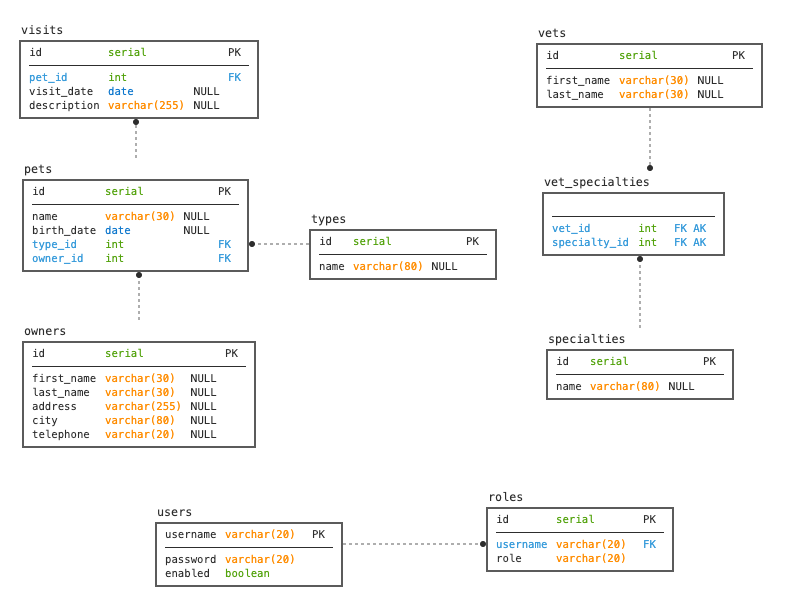

# Data correlation



# Prepare setup

## Create a new module in Etendo Classic

### Java package

`com.etendoerp.integration.petstore`

# Mapping owner

```json
[
  {
    "address": "110 W. Liberty St.",
    "city": "Madison",
    "firstName": "George",
    "id": 1,
    "lastName": "Franklin",
    "pets": [
      {
        "birthDate": "2023-09-18",
        "id": 1,
        "name": "Leo",
        "ownerId": 1,
        "type": {
          "id": 1,
          "name": "cat"
        },
        "visits": [
          {
            "date": "2023-09-18",
            "description": "rabies shot",
            "id": 1,
            "petId": 1
          }
        ]
      }
    ],
    "telephone": "6085551023"
  }
]
```

### Needed projections

We need to create projections from the lowest leaf to the upper, in owner case, we need to create in this order:

* Visit

* Pet Type

* Pet

* Owner


